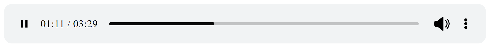
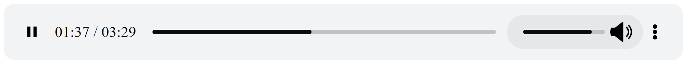

# Audio player custom html structure
jPlayer with implement custom html structure

Help link: https://jplayer.org
## Screenshot 1

## Screenshot 2

**Write your won HTML and CSS** 

	

 <!-- actual player -->
	
	<!-- custom HTML structure -->
	
 
		

			

				
				
			

			
				 / 
			
		

		

			

				

					

				

			

		

		

			

				

					

				

				
				
			

			

		

	

**Import link jquery library and jplayer** 

	
    
 ----

		$(document).ready(function(){
			// for the player 1
			$("#myplayer").jPlayer({
				ready: function () {
					$(this).jPlayer("setMedia", {
						title: "Bubble",
						m4a: "http://jplayer.org/audio/m4a/Miaow-07-Bubble.m4a",
						mp4: "https://www.w3schools.com/html/horse.mp3",
						oga: "http://jplayer.org/audio/ogg/Miaow-07-Bubble.ogg"  
					});
				},
				
				supplied: "m4a, oga, mp3",
				wmode: "window",
				volume: 0.5,
				useStateClassSkin: true,
				autoBlur: false,
				smoothPlayBar: true,
				keyEnabled: true,
				remainingDuration: true,
				toggleDuration: true,
				
				cssSelectorAncestor: "#custom-layout-1",
				cssSelector: {
				videoPlay: '.jp-video-play',
				play: '.play-button',
				pause: '.pause-button',
				stop: '.jp-stop',
				seekBar: '.jp-progress',
				playBar: '.jp-progress-bar',
				mute: '.mute-button',
				unmute: '.unmute-button',
				volumeBar: '.vol-bar',
				volumeBarValue: '.vol-bar-value',
				currentTime: '.jp-current-time',
				duration: '.jp-duration',
				}
			});
		});